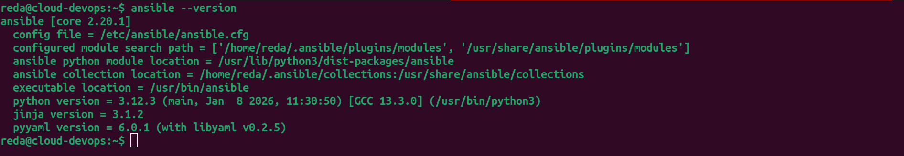
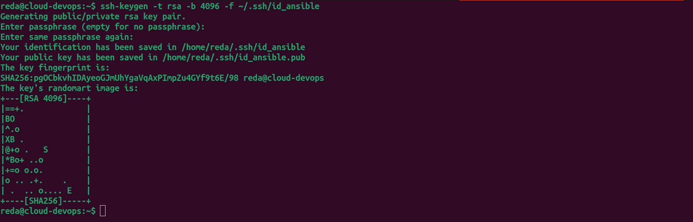
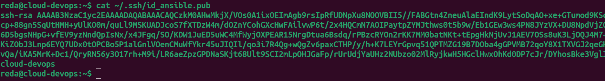
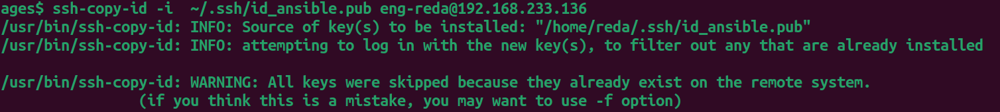
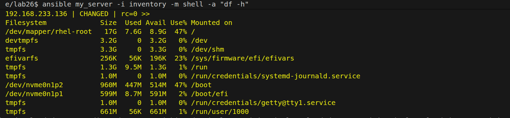

# Objective
Install and configure Ansible Automation Platform, set up SSH key-based authentication to managed nodes, and execute ad-hoc commands for basic system administration tasks.

# Concepts Covered
- Ansible architecture (control vs managed nodes)
- SSH key authentication
- Inventory file creation and management
- Ad-hoc command execution
- Ansible configuration files

# Prerequisites
- Two Linux machines (one control node, one managed node)
- Python 3.x installed on both nodes
- SSH server running on managed node
- sudo/root access on both nodes
- Network connectivity between nodes


# Steps

## Step 1: Install Ansible on Control Node
### As I use ubuntu 

```bash
sudo apt update
sudo apt install ansible -y
# Verify installation
ansible --version
```


 
## Step 2: Generate SSH Key on Control Node
```bash
# Generate SSH key
ssh-keygen -t rsa -b 4096 -f ~/.ssh/id_ansible
# Check file permissions on SSH key
chmod 600 ~/.ssh/id_ansible
chmod 644 ~/.ssh/id_ansible.pub
# View the public key
cat ~/.ssh/id_ansible.pub
```




## Step 3: Copy SSH Key to Managed Nodes
```bash
# using ssh-copy-id method
ssh-copy-id -i  ~/.ssh/id_ansible.pub eng-reda@192.168.233.136
```



## Step 4: Create inventory of a managed node
### Create inventory file

```bash
touch inventory
```
### Add my server in the inventory file
<pre>
[my_server]
192.168.233.136 ansible_user=eng-reda ansible_ssh_private_key_file=~/.ssh/id_ansible
</pre>

## Step 5: Perform ad-hoc command (check disk space)

```bash
ansible my_server -i inventory -m shell -a "df -h"
```

