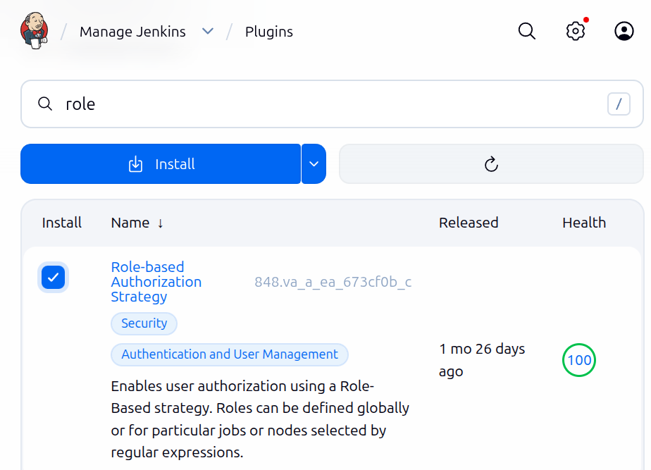
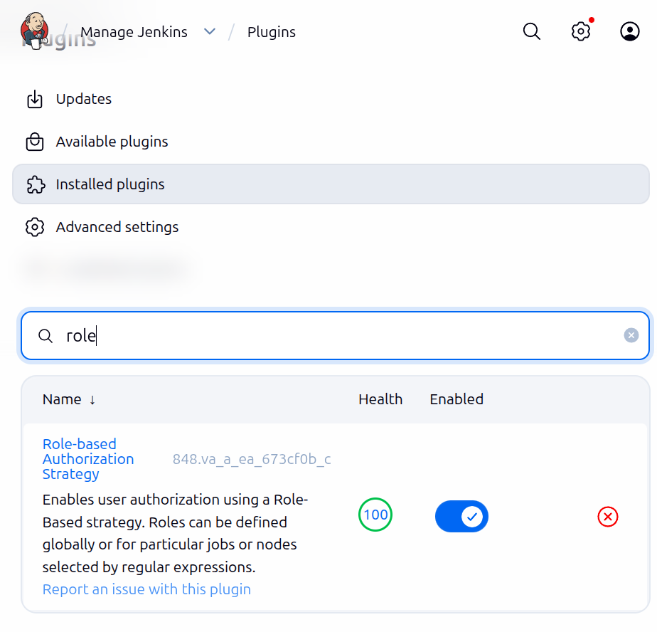
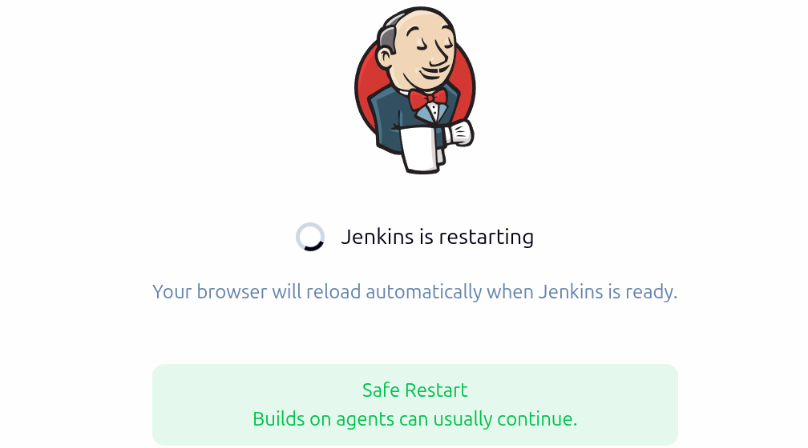
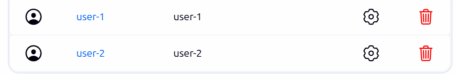
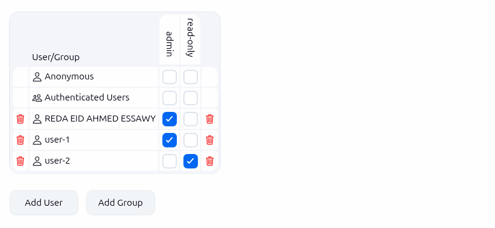
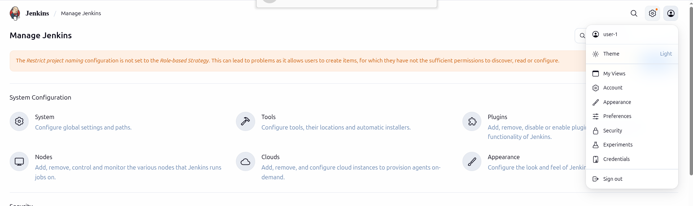
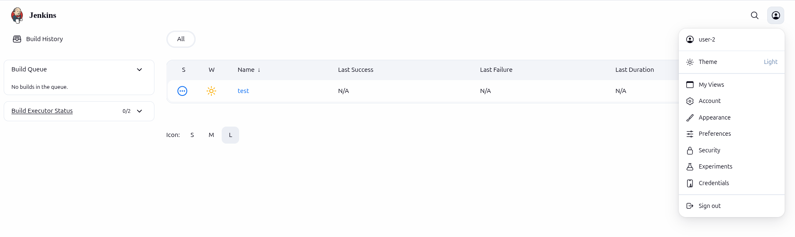

# Objective
Configure Jenkins with role-based authorization to control user access to jobs, views, and administrative functions based on assigned roles.

---

# Concepts Covered
- Jenkins security realm configuration
- Role-based authorization strategy
- Matrix-based security
- User and group management
- Project-based matrix authorization

---

# Prerequisites
- Jenkins installed and accessible
- Admin access to Jenkins
- Role-based Authorization Strategy plugin installed
- Basic understanding of Jenkins security

---

# Steps

## Step 1: Install Required Plugins

Ensure the required plugins are installed.

### Web UI Actions
1. Go to **Manage Jenkins → Manage Plugins**
2. Open the **Available** tab
3. Search for and install:
   - **Role-based Authorization Strategy**
   - **Matrix Authorization Strategy Plugin** (if not already installed)
4. Restart Jenkins if prompted

### Screenshots

---

## Step 2: Enable Role-based Authorization Strategy

### Web UI Actions
1. Go to **Manage Jenkins → Configure Global Security**
2. Under **Authorization**, select **Role-Based Strategy**
3. Click **Save**

> 💡 This switches Jenkins authorization from global matrix to role-based access control.

---

## Step 3: Create Users

### Web UI Actions
1. Go to **Manage Jenkins → Manage Users**
2. Click **Create User**
3. Create the following users:

**User 1**
- Username: `user1`
- Password: `user1pass`
- Full name: `User One`
- Email: `user1@example.com`

**User 2**
- Username: `user2`
- Password: `user2pass`
- Full name: `User Two`
- Email: `user2@example.com`

### Screenshot

---

## Step 4: Configure Global Roles

### Web UI Actions
1. Go to **Manage Jenkins → Manage and Assign Roles → Manage Roles**
2. Under **Global Roles**, click **Add Role**

### Admin Role
- Role Name: `admin`
- Pattern: `.*`
- Permissions:
  - Overall: Administer, Read
  - Agent: Create, Delete, Configure, Connect, Disconnect
  - Job: Create, Delete, Configure, Build, Cancel, Read
  - Run: Delete, Update
  - View: Create, Delete, Configure, Read
  - SCM: Tag

### Read-only Role
- Role Name: `read-only`
- Pattern: `.*`
- Permissions:
  - Overall: Read
  - Job: Read
  - View: Read
  - Metrics: View

### Screenshot

---

## Step 5: Assign Global Roles to Users

### Web UI Actions
1. Go to **Manage Jenkins → Manage and Assign Roles → Assign Roles**
2. Assign roles as follows:
   - `user1` → **admin**
   - `user2` → **read-only**
   - `authenticated` → **read-only**
   - `anonymous` → No permissions (or minimal read if required)
3. Click **Save**

### Screenshot

---

## Step 6: Test Role Assignments

### Test as user1 (Admin)
Verify that user1 can:
- Access **Manage Jenkins**
- Create, configure, and delete jobs
- Modify system configuration

---

### Test as user2 (Read-only)
Verify that user2 can:
- View jobs
- Cannot create or configure jobs
- Cannot access **Manage Jenkins**

---

## ✅ Result
Role-based authorization is successfully configured, enforcing proper access control based on user roles.

---

## 💡 Real-World Use Case
This setup is commonly used in enterprise Jenkins environments to:
- Restrict CI/CD configuration access
- Separate admin and developer responsibilities
- Improve overall security posture
