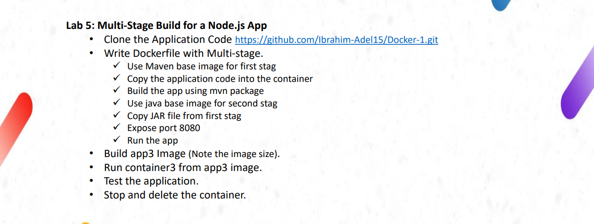
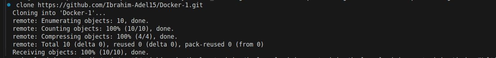
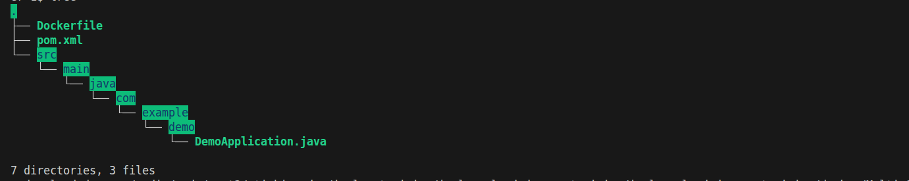
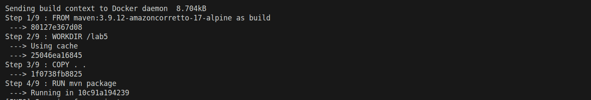
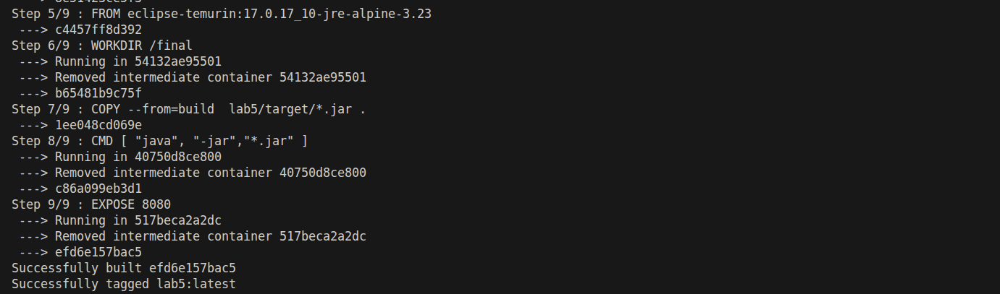
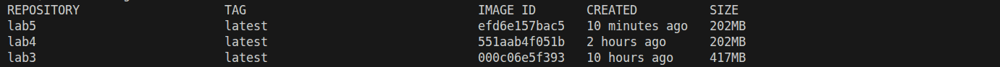
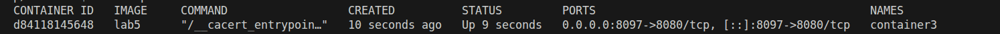
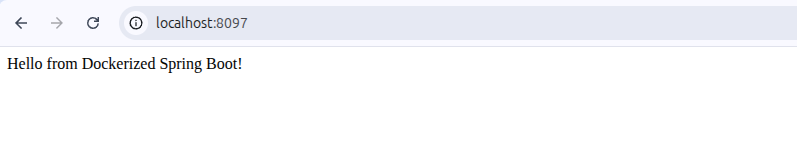
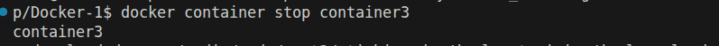
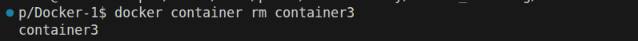

# lab instractions

# clone the app code
# git clone https://github.com/Ibrahim-Adel15/Docker-1.git

# tree the dir after clonning
# $ tree

# build the image from Dockerfile with consideration multi stages app, in the first stage build the application
# and in the second stage run the application using .jar file only and don't copy all files this will improve the size of the image

# first stage

# second stage

# note the size of this image is the same of that use build the app on the locall machine and run .jar file using java. in this
# image the first stage do the same role of build app on the locall machine but in this case the container is not depends on external resources

# Run container3 from lab5 image
# docker run -d  --name container3 -p 8097:8080 lab5 
# docker ps -a

# listent to 8097 port on the browser for testing

# stop container
# $ docker container stop container3

# delete container
# $ docker container rm  container3
