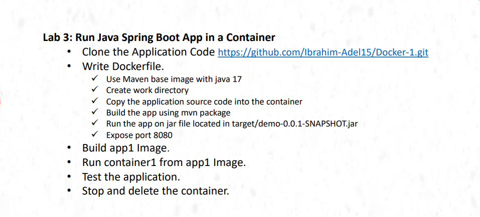
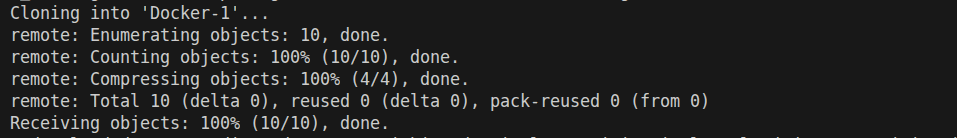
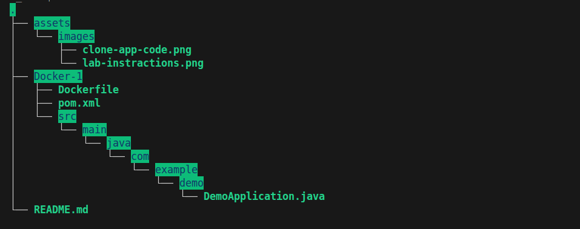
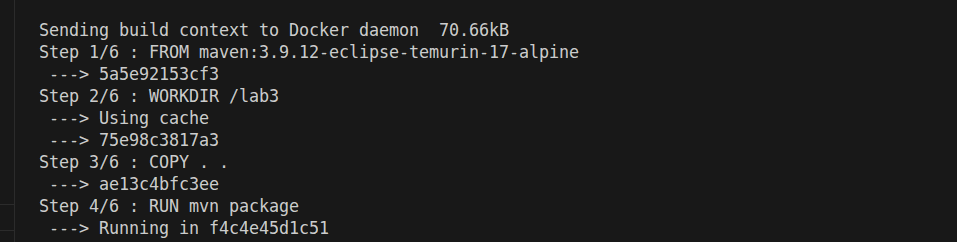
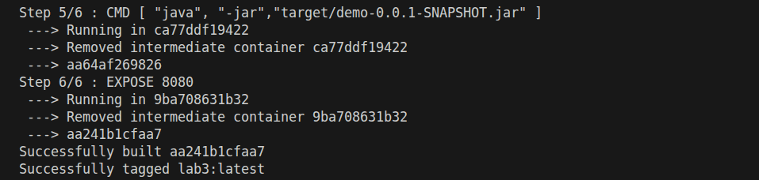
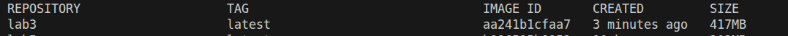
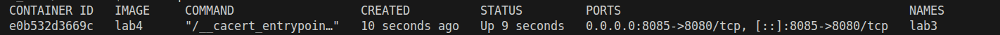
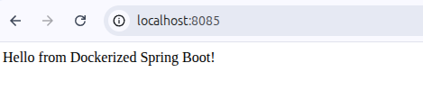
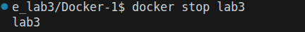
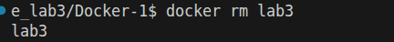

# lab instractions

# clone the app code 
# $ git clone https://github.com/Ibrahim-Adel15/Docker-1.git

# tree the dir after clonning

# build the image from the Dockerfile

# build lab3 image
# $ docker build -t lab3 .

# run lab3 container from lab3 image
# $ docker run -d --name lab3 -p 8085:8080 lab4

# listen on port 8085 on the browser

# stop the container 

# delete the container

