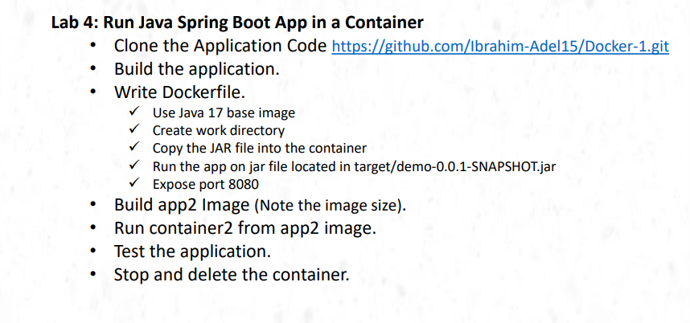
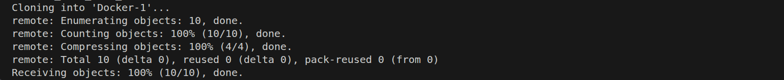
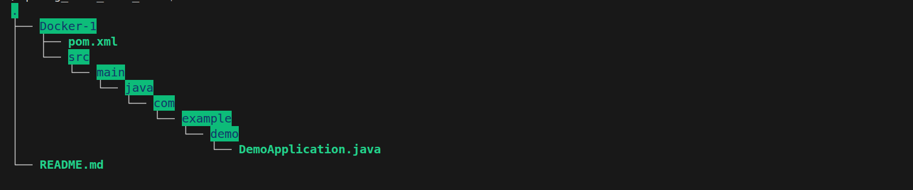
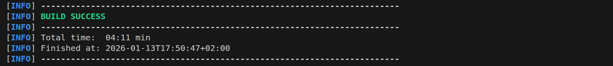
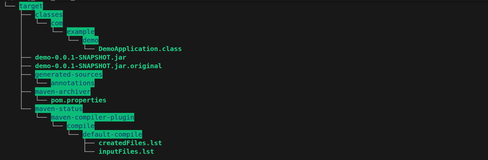
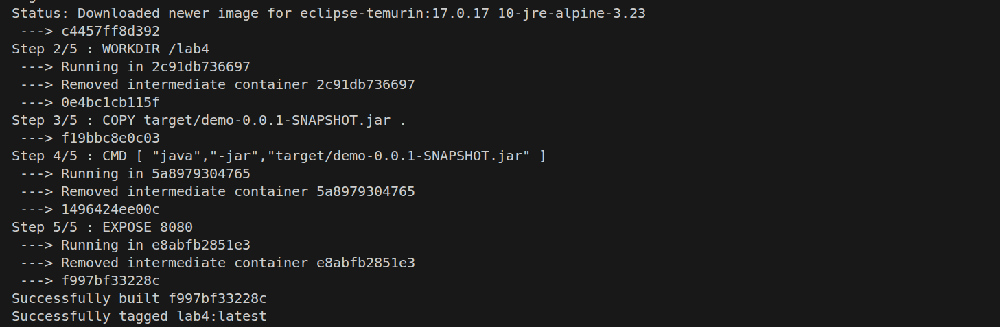
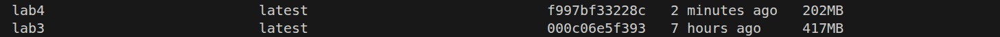
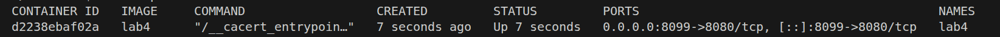
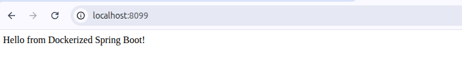

# lab instractions 

# Clone the App code 
# $ git clone https://github.com/Ibrahim-Adel15/Docker-1.git

# the app code tree after clonning

# build the app locally
# $ mvn package
# the last snapshot from output that show the success of building process

# tree command after building the application, notice that appearing of .jar file that used in the container

# build the lab4 image from Dockerfile with notice the size of the image
# $ docker build -t lab4 .

# note that the size of this image is half of the size of the previos image as the Dockerfile copy .jar file only

# build a lab4 container from lab4 image
# $ docker run -d --name lab4 -p 8099:8080 lab4
# $ docker ps -a 

# listen on 8099 port from the browser
