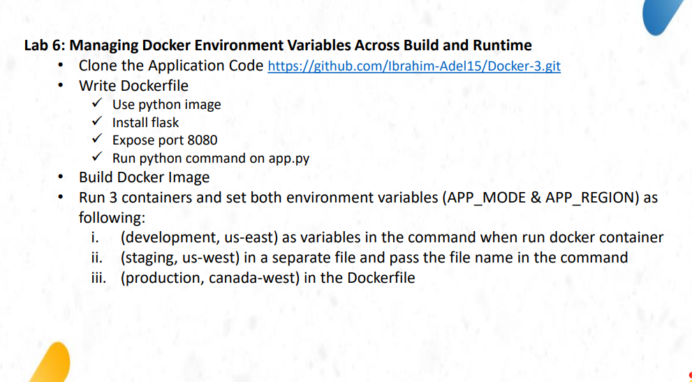
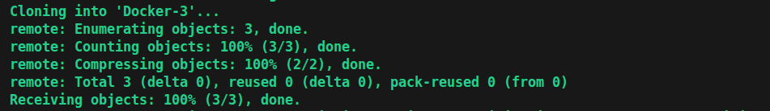
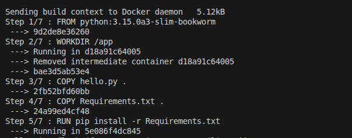
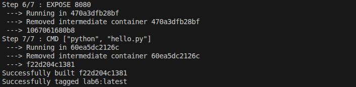
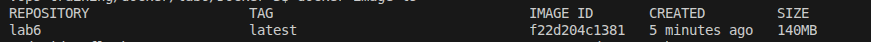
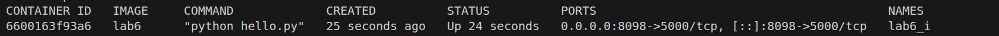
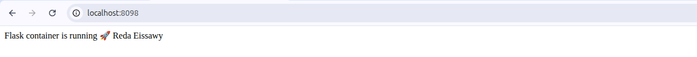
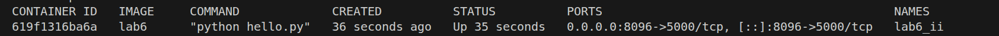
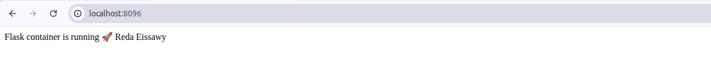
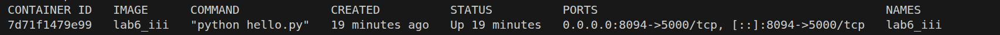

# lab instractions

# clone the app code
# $ git clone https://github.com/Ibrahim-Adel15/Docker-3.git

# build the image from the Dockerfile
# $ docker build -t lab6 .

# the image
# $ docker image ls 

# run a lab6_i containre from Dockerfile and path variables in command
# docker container run -d --name lab6_i -e APP_MODE=development -e APP_REGION=us-east -p 8098:5000 lab6

# test the lab6_iii container on 8098 port on the browser

# run a lab6_ii containre from Dockerfile and path variables in command
# docker container run -d --name lab6_ii --env-file=env -p 8098:5000 lab6

# test the lab6_ii container on 8096 port on the browser

# build the lab6_iii image from Dockerfile 
# note 4/8 step of Environment
# $ docker build -t lab6_iii .

# the lab6_iii container

# test the lab6_iii container on 8094 port on the browser

