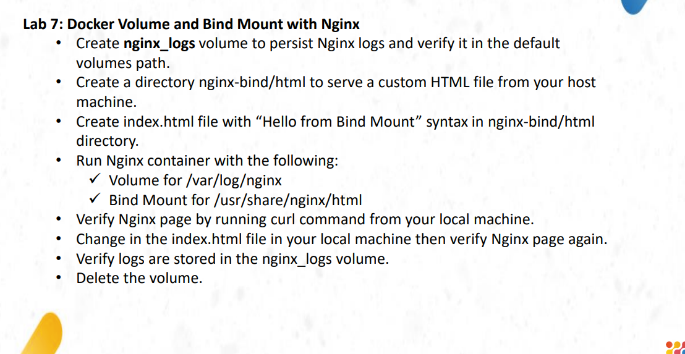
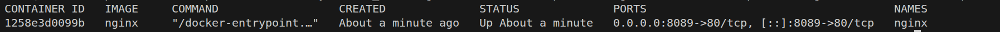
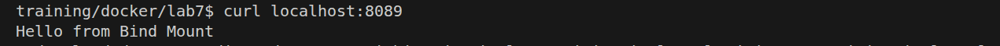
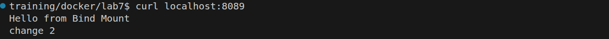
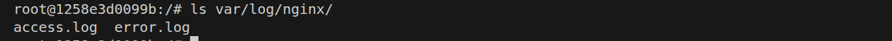

# lab instractions

# to create a volume run the following command
# $  docker volume create nginx_logs

# run > mkdir -p  nginx-bind/html to create  dires 

# run the nginx container

# Verifying Nginx page by running curl command from your local machine.

# Change in the index.html file in your local machine then verify Nginx page again.

# Verify logs are stored in the nginx_logs volume

