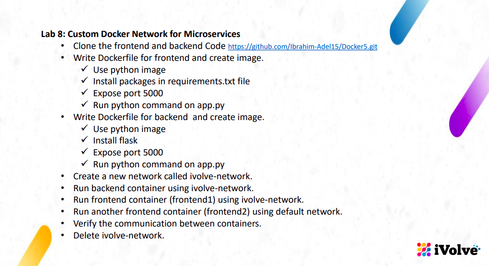
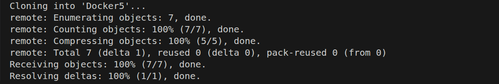
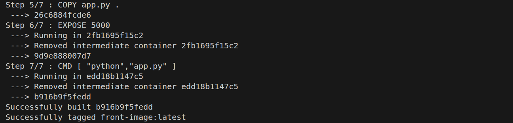
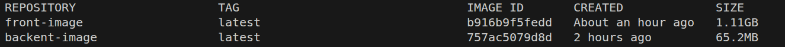
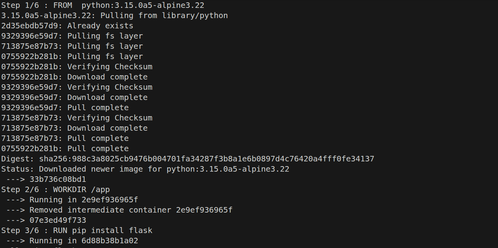
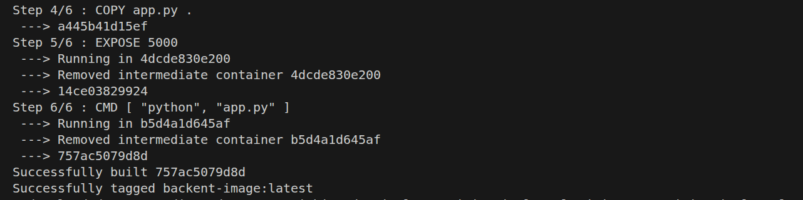
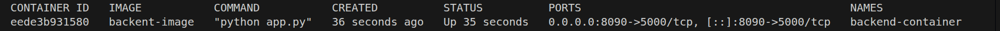
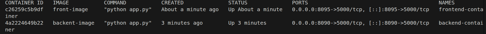

# lab istractions and overview

# clone the frontend and backend code
# $ git clone  https://github.com/Ibrahim-Adel15/Docker5.git

# first build frontend image using Dockerfile to use it in frontend1, and frontend2 container
# $ docker build -t frontend-image .

# second build backend image using Dockerfile to use it in backend container# $ docker build -t backent-image .
     

# run the  backend-container container using backent image in ivolve-network network 
# $ docker container run --name backend-container -d -p 8090:5000 backent-image

# run the front-container container using fron-image in ivolve-network network
# $ docker container run --name frontend-container -d --network ivolve-network -p 8095:5000 front-image

# run frontend2 container with the default network using front-image image
# $ docker container run --name frontend2 -d  -p 8098:5000 front-image

