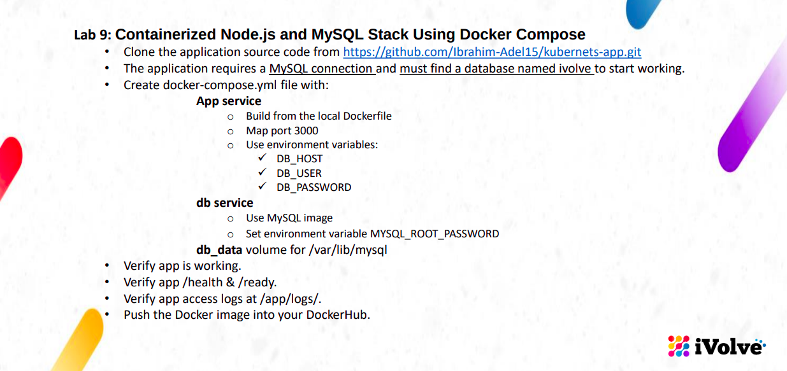
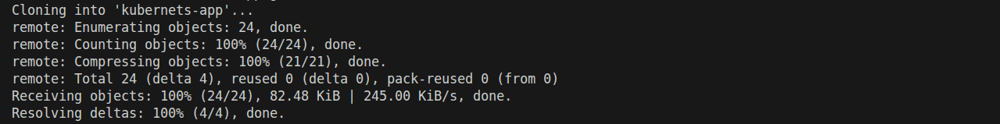
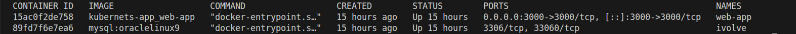
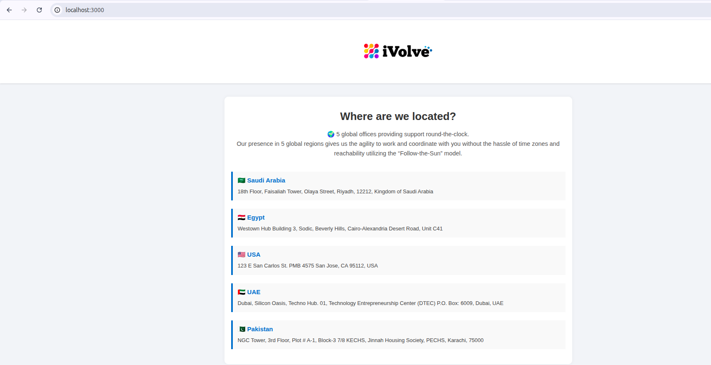
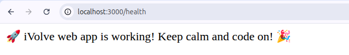
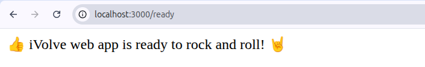
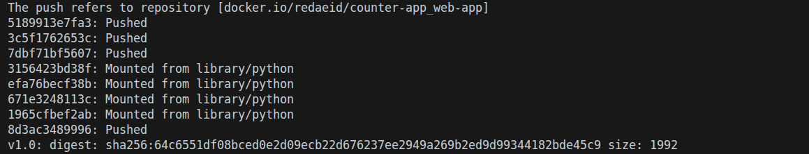
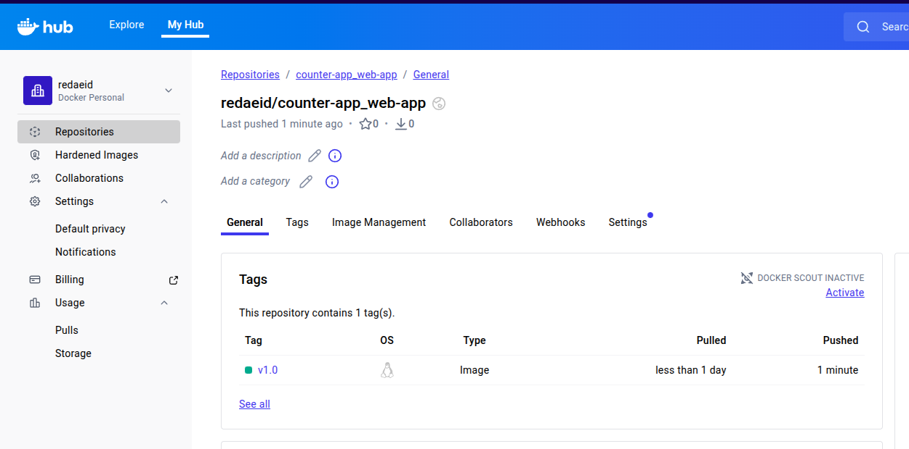

# lab instractions and overview

# clone the application source code 
# $ git clone  https://github.com/Ibrahim-Adel15/kubernets-app.git

# up docker-compose
# $ docker-compose up -d 
# docker ps -a 

# Verify app is working

# Verify app /health & /ready

# push the image into DockerHub

